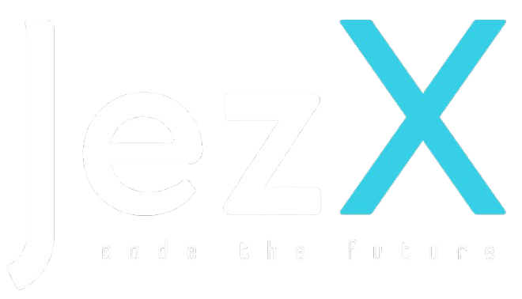

# JezX - Official Website

<div align="center">
  
  <h3>Code the Future</h3>
</div>

## Overview

This repository contains the official website for JezX, a brand of Jezh Technologies Private Limited. JezX specializes in AI-powered software solutions, custom development, and digital transformation services designed to help businesses automate processes and drive growth.

## Intellectual Property Notice

© 2025 Jezh Technologies Private Limited. All Rights Reserved.

**IMPORTANT LEGAL NOTICE:**

This codebase and all associated assets, designs, and content are the exclusive intellectual property of Jezh Technologies Private Limited. Any unauthorized use, reproduction, modification, distribution, or display of this software without explicit written permission from Jezh Technologies Private Limited is strictly prohibited and may result in severe legal consequences.

## Technology Stack

This website is built using modern web technologies:

- **Frontend Framework**: React with TypeScript
- **Build Tool**: Vite
- **UI Components**: shadcn/ui
- **Styling**: Tailwind CSS
- **Routing**: React Router
- **State Management**: React Query

## Development

### Prerequisites

- Node.js (v16.0.0 or higher)
- npm (v7.0.0 or higher)

### Local Development

For authorized developers, follow these steps to set up the local development environment:

```bash
# Clone the repository
git clone [repository-url]

# Navigate to project directory
cd jezx-ai-nexus-website-main

# Install dependencies
npm install

# Start development server
npm run dev
```

The development server will be available at `http://localhost:8080`

### Build for Production

```bash
# Generate production build
npm run build

# Preview production build locally
npm run preview
```

## Deployment

The website is configured for deployment to various hosting platforms including Vercel, Netlify, and traditional web hosting services. The build process includes special handling for SPA routing to ensure proper navigation.

## Project Structure

```
jezx-ai-nexus-website-main/
├── public/             # Static assets
│   ├── logo/           # Logo files
│   └── ...
├── src/
│   ├── components/     # Reusable UI components
│   ├── pages/          # Page components
│   ├── lib/            # Utility functions and helpers
│   ├── App.tsx         # Main application component
│   └── main.tsx        # Application entry point
├── index.html          # HTML template
└── package.json        # Project dependencies and scripts
```

## Contact Information

For inquiries regarding this website or to request permission for use:

- **Email**: info@jezx.in
- **Phone**: +91 91505 37718
- **Website**: [https://jezx.in](https://jezx.in)
- **Address**: Nagercoil, Kanyakumari, Tamil Nadu, India

## License

This project is proprietary software. No license is granted for its use, modification, or distribution without explicit written permission from Jezh Technologies Private Limited.
